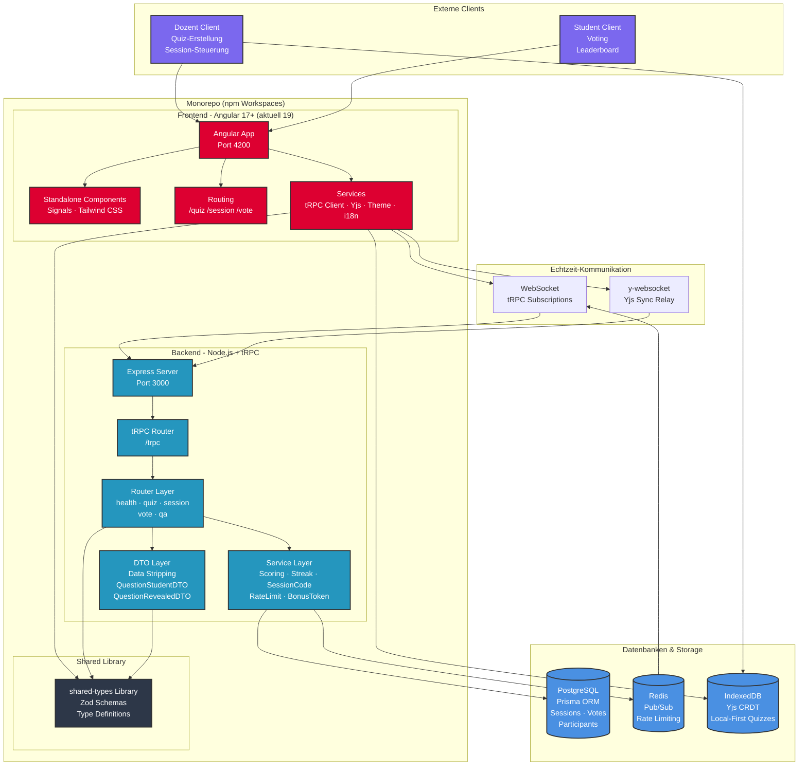
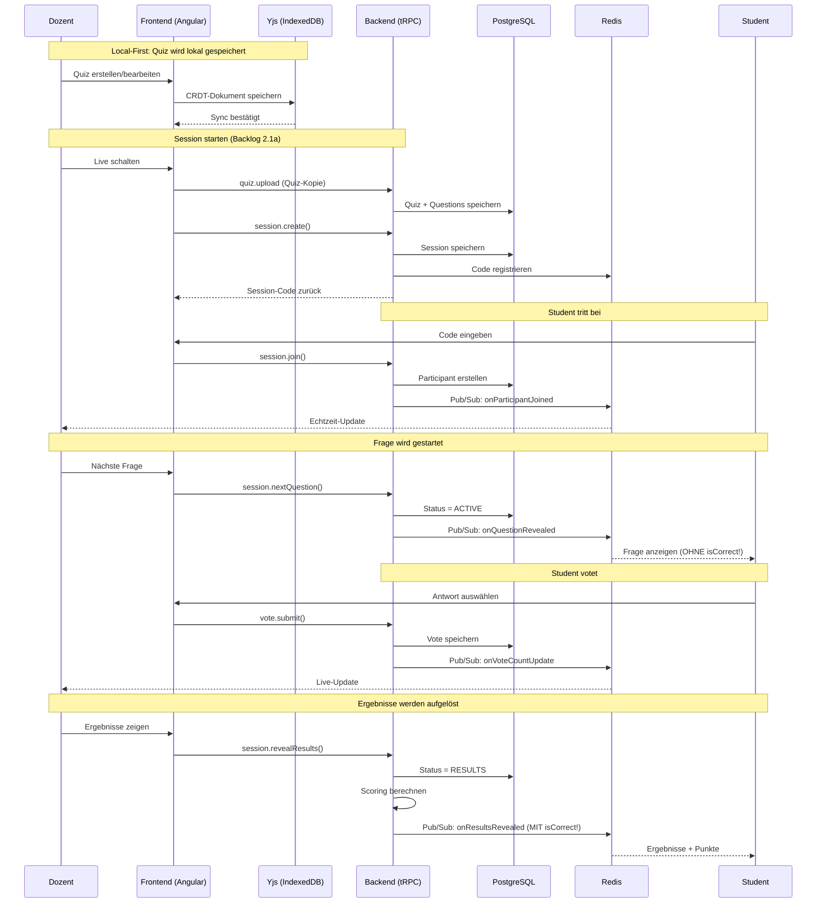
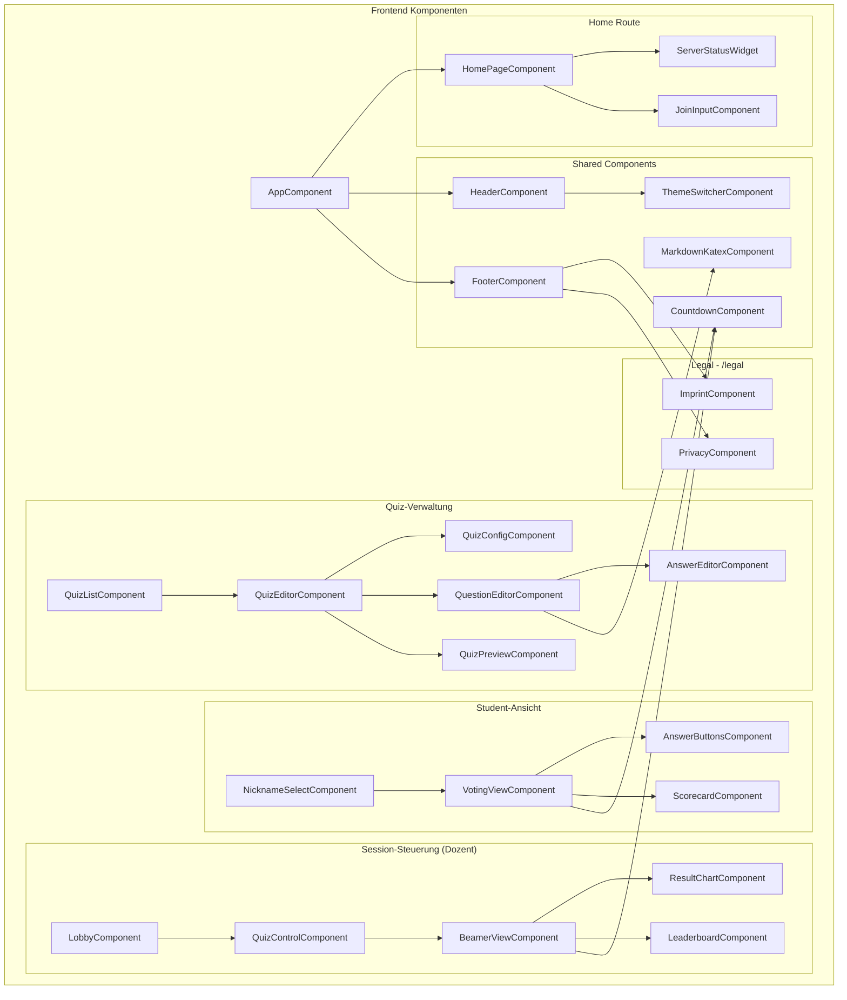
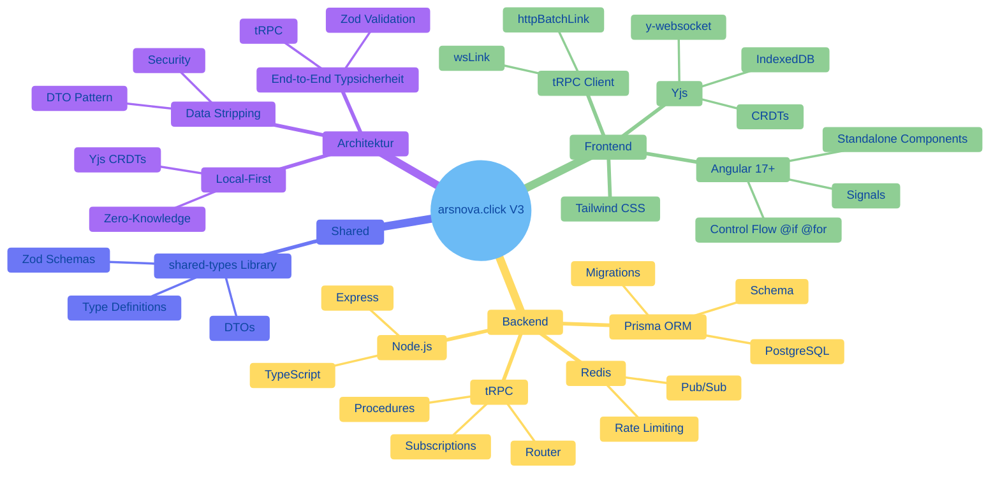
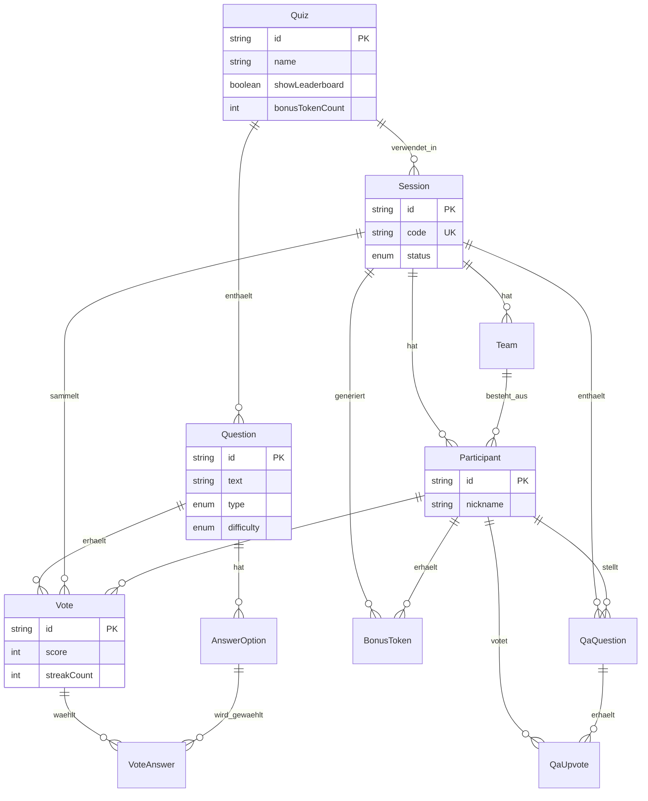
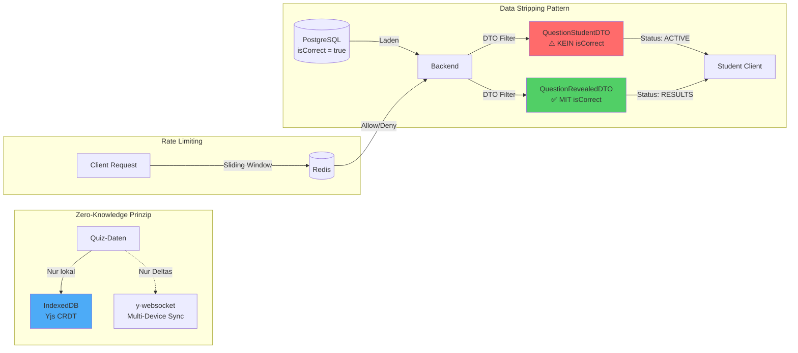

# 🏗️ Architektur-Übersicht: arsnova.click V3

**Erstellt:** 2026-02-20  
**Zweck:** Visualisierung der gesamten Codebasis-Struktur und Architektur

## System-Architektur-Diagramm

## Datenfluss-Diagramm

## Komponenten-Hierarchie

## Technologie-Stack Übersicht

## Datenbank-Schema Übersicht

## Sicherheits-Architektur

---

**Weitere Diagramme:** Detaillierte Backend- und Frontend-Komponenten, Datenbank-Schema, Kommunikation Dozent/Student sowie Aktivitätsablauf finden sich in [diagrams.md](./diagrams.md) (Mermaid, von GitHub gerendert).

**Hinweis:** Diese Diagramme sind eine **vereinfachte Übersicht** (Living Documentation). Die vollständige Komponentenliste und alle DTOs finden sich in [diagrams.md](./diagrams.md). Bei größeren Architekturänderungen sollten beide Dateien aktualisiert werden.
