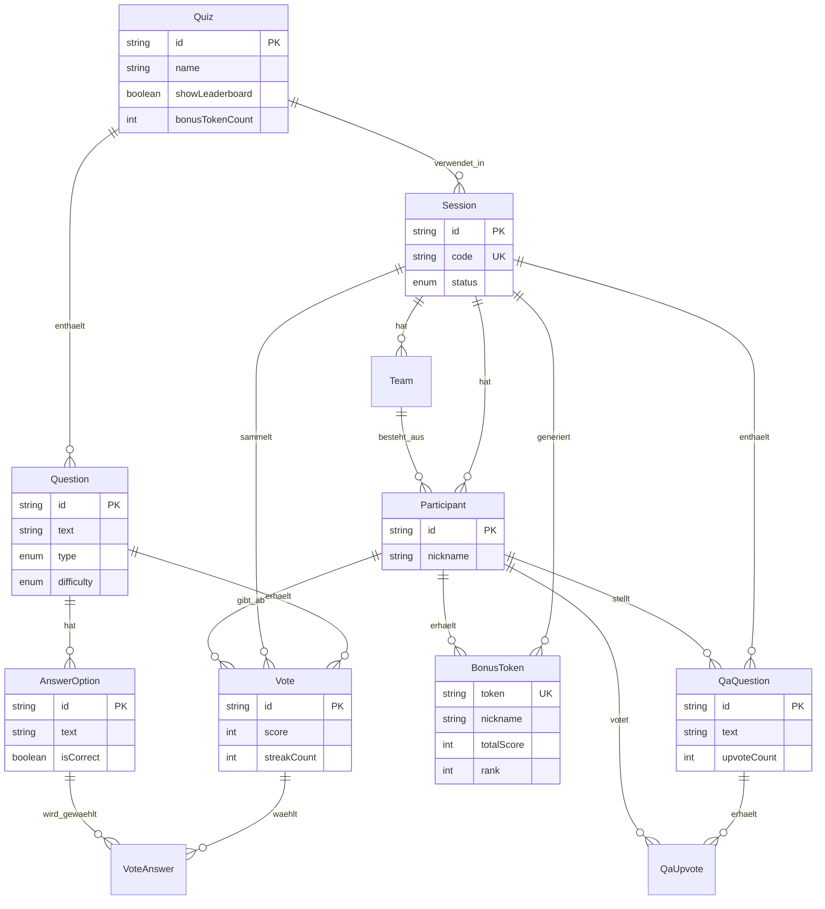
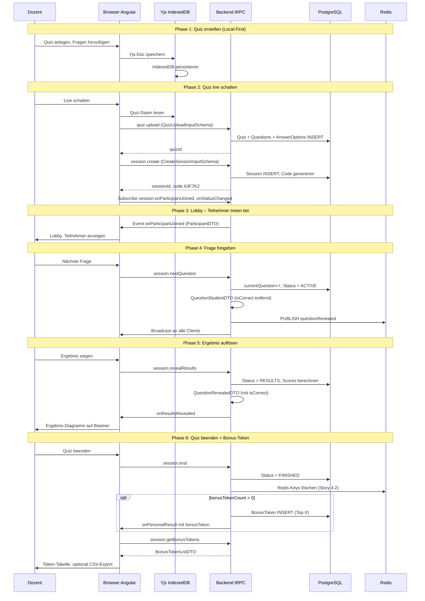
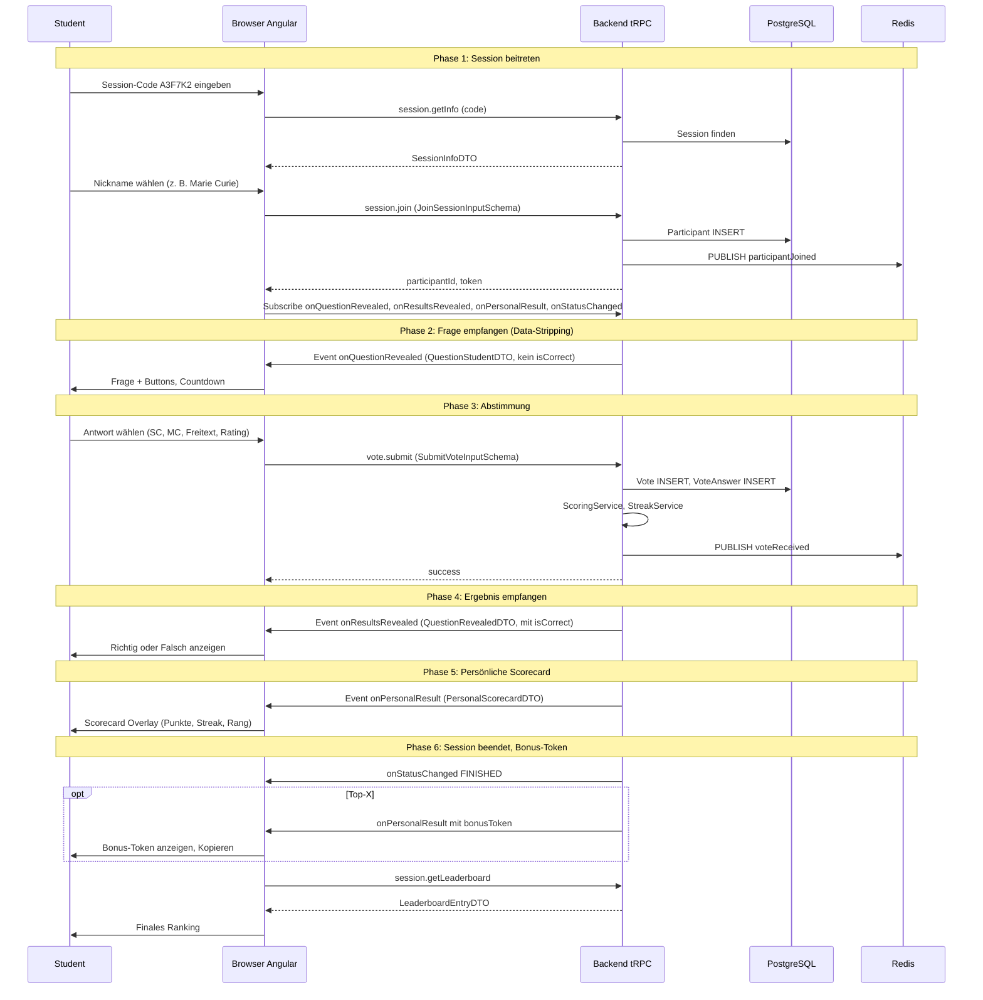
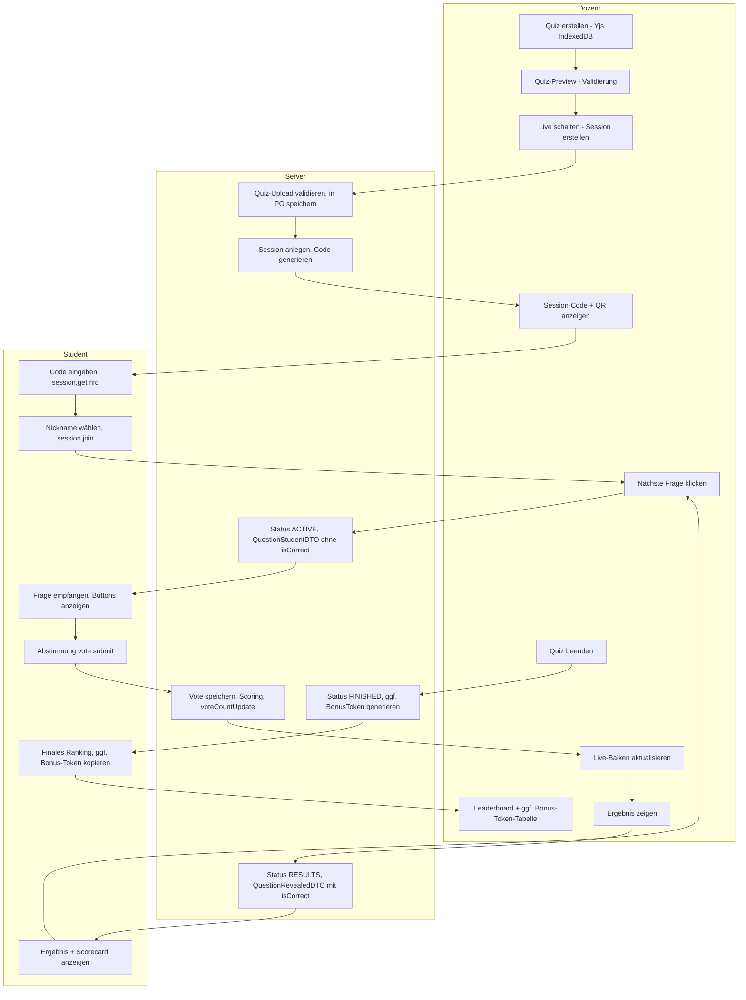

# Diagramme: arsnova.click V3

Alle Diagramme sind in Mermaid geschrieben und werden von GitHub nativ gerendert.  
**Stand:** 2026-02-20

> **VS Code:** Mermaid wird in der Standard-Markdown-Vorschau nicht gerendert. Bitte die Erweiterung **„Markdown Preview Mermaid Support“** (`bierner.markdown-mermaid`) installieren. Siehe [README.md](./README.md) in diesem Ordner.

---

## 1. Backend-Architektur (Komponenten)

Express · tRPC · Prisma 7 · Redis · WebSocket (Ziel-Architektur)

```mermaid
graph TB
    subgraph Entry["Entry Point"]
        express[Express Server - Port 3000]
        cors[CORS Middleware]
        trpcmw["tRPC Middleware (trpc)"]
    end

    subgraph Router["appRouter (tRPC)"]
        health[healthRouter]
        quiz[quizRouter]
        session[sessionRouter]
        vote[voteRouter]
        qa[qaRouter]
    end

    subgraph Services["Services"]
        scoring[ScoringService]
        streak[StreakService]
        codegen[SessionCodeService]
        cleanup[CleanupService]
        ratelimit[RateLimitService]
        tokenservice[BonusTokenService]
    end

    subgraph DTO["DTO Layer - Data-Stripping"]
        studdto[QuestionStudentDTO - kein isCorrect]
        revdto[QuestionRevealedDTO - mit isCorrect]
        sessiondto[SessionInfoDTO]
        lbdto[LeaderboardEntryDTO]
        scoredto[PersonalScorecardDTO]
    end

    subgraph Validation["Validation - shared-types"]
        submitvote[SubmitVoteInputSchema]
        createsession[CreateSessionInputSchema]
        quizupload[QuizUploadInputSchema]
    end

    pg[(PostgreSQL - Prisma 7)]
    redis[(Redis PubSub + Rate-Limit)]
    wss[WebSocket Server]
    yws["y-websocket Relay"]

    express --> cors --> trpcmw
    trpcmw --> health
    trpcmw --> quiz
    trpcmw --> session
    trpcmw --> vote
    trpcmw --> qa

    session --> scoring
    session --> streak
    session --> codegen
    session --> cleanup
    session --> tokenservice
    vote --> scoring
    vote --> streak
    vote --> ratelimit
    qa --> ratelimit

    session --> studdto
    session --> revdto
    session --> sessiondto
    session --> lbdto
    session --> scoredto
    vote --> submitvote
    quiz --> quizupload
    session --> createsession

    scoring --> pg
    streak --> pg
    tokenservice --> pg
    cleanup --> pg
    cleanup --> redis
    ratelimit --> redis
    session --> redis
    session --> wss
    express --> yws
```

---

## 2. Frontend-Architektur (Komponenten)

Angular 19 · Standalone Components · Signals · Tailwind CSS

```mermaid
graph TB
    subgraph Root["Root"]
        app[AppComponent]
        routes[app.routes.ts]
        config[app.config.ts]
    end

    subgraph Shared["Shared Components"]
        header[HeaderComponent]
        footer[FooterComponent]
        theme[ThemeSwitcherComponent]
        lang[LanguageSwitcherComponent]
        countdown[CountdownComponent]
        mdkatex[MarkdownKatexComponent]
        confirm[ConfirmDialogComponent]
    end

    subgraph Home["Home (Root)"]
        home[HomePageComponent]
        status[ServerStatusWidget]
        join[JoinInputComponent]
    end

    subgraph Quiz["Quiz-Verwaltung (Route quiz)"]
        quizlist[QuizListComponent]
        editor[QuizEditorComponent]
        quizconfig[QuizConfigComponent]
        questionedit[QuestionEditorComponent]
        answeredit[AnswerEditorComponent]
        preview[QuizPreviewComponent]
        importexport[ImportExportComponent]
    end

    subgraph Session["Session-Steuerung Dozent (session)"]
        lobby[LobbyComponent]
        control[QuizControlComponent]
        qamoderator[QaModeratorComponent]
        tokenlist[BonusTokenListComponent]
    end

    subgraph Beamer["Beamer (session present)"]
        beamer[BeamerViewComponent]
        chart[ResultChartComponent]
        wordcloud[WordcloudComponent]
        histogram[RatingHistogramComponent]
        leaderboard[LeaderboardComponent]
        emojioverlay[EmojiOverlayComponent]
        qrcode[QrCodeComponent]
    end

    subgraph Student["Student (session vote)"]
        nickname[NicknameSelectComponent]
        voting[VotingViewComponent]
        buttons[AnswerButtonsComponent]
        mctoggle[McToggleButtonsComponent]
        ratingscale[RatingScaleComponent]
        freetext[FreetextInputComponent]
        scorecard[ScorecardComponent]
        tokendisplay[BonusTokenDisplay]
        motivation[MotivationMessageComponent]
        emojibar[EmojiBarComponent]
        qastudent[QaStudentComponent]
    end

    subgraph Legal["Legal (impressum, datenschutz)"]
        imprint[ImprintComponent]
        privacy[PrivacyComponent]
    end

    subgraph Services["Services"]
        trpc[trpcClient - httpBatchLink + wsLink]
        yjs["YjsService (IndexedDB + y-websocket)"]
        themesvc[ThemeService]
        i18nsvc[I18nService]
    end

    backend[Backend tRPC]
    idb[(IndexedDB - Yjs CRDT)]
    ws[WebSocket - tRPC Subscriptions]

    app --> routes
    app --> header
    app --> footer
    header --> theme
    header --> lang

    home --> status
    home --> join

    quizlist --> editor
    editor --> quizconfig
    editor --> questionedit
    editor --> preview
    editor --> importexport
    questionedit --> answeredit
    questionedit --> mdkatex
    preview --> mdkatex

    lobby --> control
    control --> beamer
    control --> qamoderator
    control --> tokenlist

    beamer --> chart
    beamer --> wordcloud
    beamer --> histogram
    beamer --> leaderboard
    beamer --> emojioverlay
    beamer --> qrcode
    beamer --> countdown

    nickname --> voting
    voting --> buttons
    voting --> mctoggle
    voting --> ratingscale
    voting --> freetext
    voting --> scorecard
    voting --> countdown
    voting --> emojibar
    voting --> qastudent
    scorecard --> tokendisplay
    scorecard --> motivation

    footer --> imprint
    footer --> privacy

    trpc --> backend
    trpc --> ws
    yjs --> idb
```

---

## 3. Datenbank-Schema (PostgreSQL / Prisma)

**Hinweis (Data-Stripping):** `AnswerOption.isCorrect` wird im Status ACTIVE niemals an Studenten gesendet; erst nach RESULTS-Auflösung (QuestionRevealedDTO).

---

## 4. Kommunikation Dozent-Client ↔ Backend

Vereinfachtes Sequenzdiagramm (tRPC HTTP + WebSocket).

---

## 5. Kommunikation Student-Client ↔ Backend

Vereinfachtes Sequenzdiagramm (tRPC HTTP + WebSocket).

---

## 6. Aktivitätsablauf: Dozent · Student · Server

Vereinfachtes Aktivitätsdiagramm (Quiz-Lifecycle).

**Legende:**  
- **QuestionStudentDTO:** isCorrect wird serverseitig entfernt (Story 2.4).  
- **QuestionRevealedDTO:** isCorrect erst nach expliziter Auflösung (RESULTS).  
- **Bonus-Token (Story 4.6):** Nur für Top-X, individuell per onPersonalResult.
