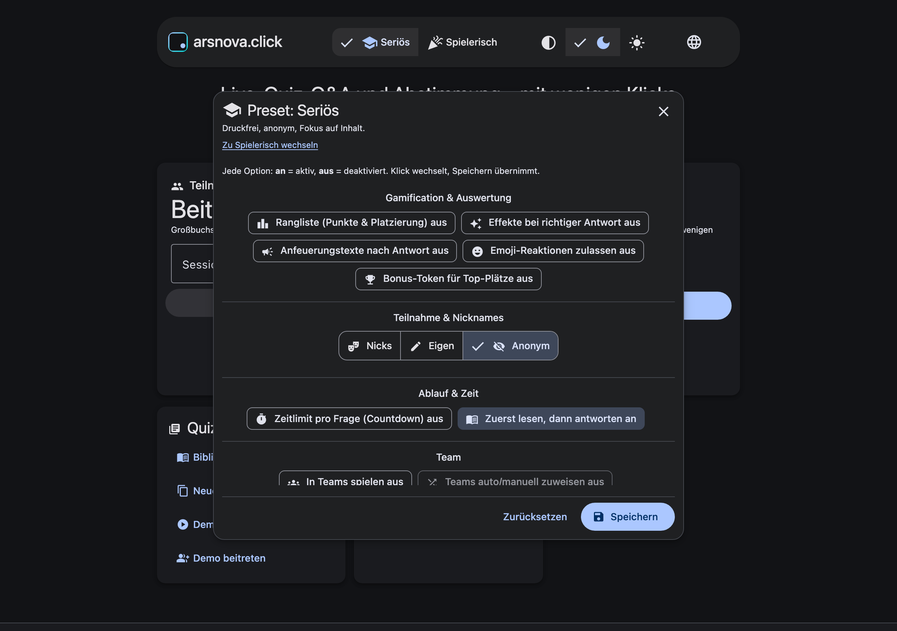
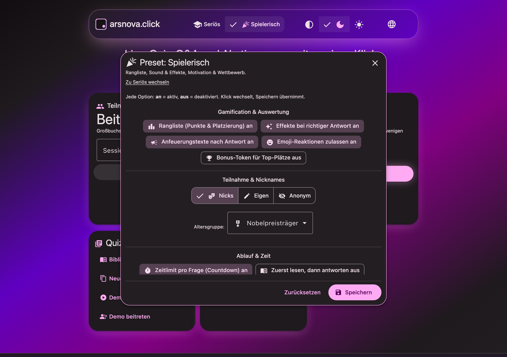
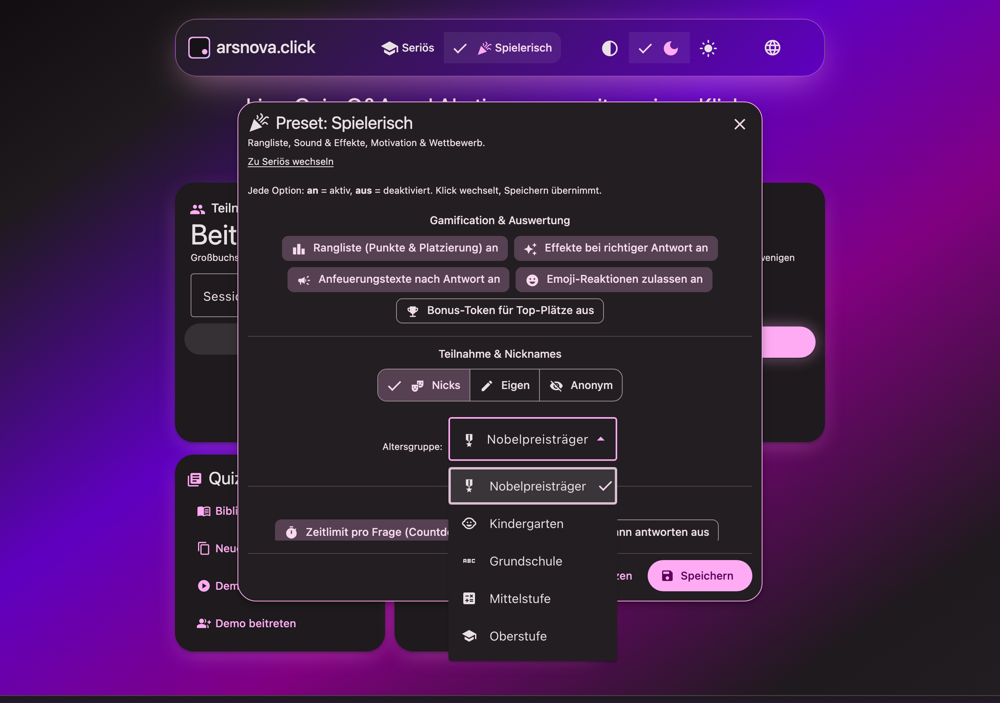
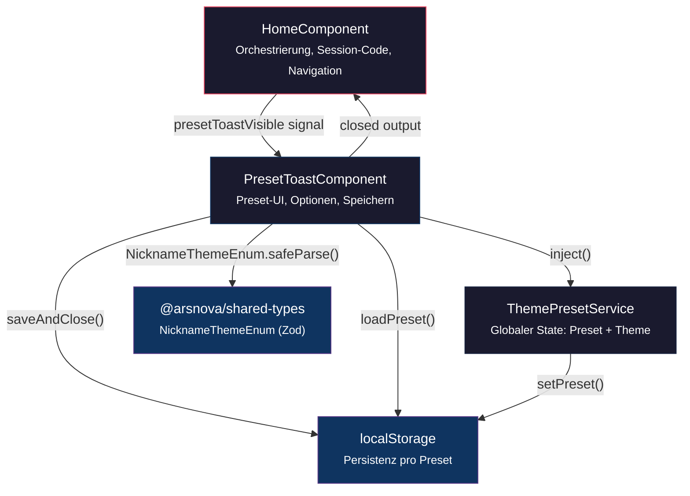
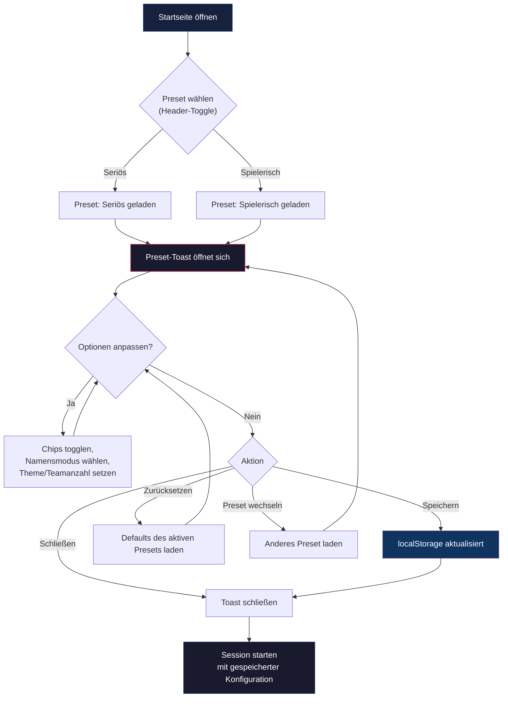

# Preset-Modi (Session-Voreinstellungen)

Die Preset-Modi sind ein zentrales Unterscheidungsmerkmal von arsnova.click V3. Sie erlauben es Dozenten, mit **einem Klick** eine komplette Session-Konfiguration zu laden – optimiert für den jeweiligen Einsatzzweck. Kein langwieriges Zusammenklicken einzelner Optionen, kein versehentliches Vergessen eines Toggles.

## Konzept & Motivation

In klassischen Audience-Response-Systemen (Kahoot!, Mentimeter) gibt es meist einen einzigen Modus. arsnova.click V3 erkennt, dass Hörsaal-Quizze je nach Kontext **fundamental verschiedene Anforderungen** haben:

| Szenario | Bedürfnis |
|----------|-----------|
| Prüfungsvorbereitung | Kein sozialer Druck, Fokus auf Inhalt, anonyme Teilnahme |
| Auflockerung in der Vorlesung | Wettbewerb, Rangliste, Sound, Emoji-Reaktionen |
| Teamarbeit im Seminar | Gruppenbildung, kooperative Auswertung |

Die Preset-Modi lösen dieses Problem mit **zwei Grundkonfigurationen**, die der Dozent jederzeit individuell anpassen kann.

## Die zwei Presets

### Seriös

> *Druckfrei, anonym, Fokus auf Inhalt.*



**Defaults:**
- Alle Gamification-Features **aus** (keine Rangliste, keine Effekte, keine Sounds)
- Namensmodus: **Anonym**
- Lesephase: **an** (Studierende lesen zuerst die Frage, bevor die Antwortphase startet)
- Zeitlimit: **aus**

**Typischer Einsatz:** Formative Assessments, Prüfungsvorbereitung, sensible Themen, bei denen Studierende sich nicht exponieren sollen.

### Spielerisch

> *Rangliste, Sound & Effekte, Motivation & Wettbewerb.*



**Defaults:**
- Rangliste: **an**
- Effekte bei richtiger Antwort: **an**
- Anfeuerungstexte: **an**
- Emoji-Reaktionen: **an**
- Sound: **an**
- Zeitlimit: **an**
- Namensmodus: **Nicks** (mit Altersgruppe „Nobelpreisträger")
- Lesephase: **aus**

**Typischer Einsatz:** Auflockerung in der Vorlesung, Wettbewerbs-Quizze, Gamified Learning.

## Optionen im Detail

Jede Option ist ein Toggle (an/aus) und gehört zu einer Kategorie:

### Gamification & Auswertung

| Option | Icon | Beschreibung |
|--------|------|-------------|
| Rangliste (Punkte & Platzierung) | `leaderboard` | Zeigt eine Live-Rangliste nach jeder Frage |
| Effekte bei richtiger Antwort | `auto_awesome` | Visuelle Belohnungseffekte bei korrekter Antwort |
| Anfeuerungstexte nach Antwort | `campaign` | Motivierende Nachrichten nach der Antwortabgabe |
| Emoji-Reaktionen zulassen | `emoji_emotions` | Teilnehmer können mit Emojis reagieren |
| Bonus-Token für Top-Plätze | `emoji_events` | Belohnungen für die besten Platzierungen |

### Teilnahme & Nicknames

Der Namensmodus bestimmt, wie Teilnehmer im Quiz erscheinen:

| Modus | Icon | Beschreibung |
|-------|------|-------------|
| **Nicks** | `theater_comedy` | Vordefinierte Pseudonyme aus einer Altersgruppe (s. Nickname-Themes) |
| **Eigen** | `edit` | Teilnehmer wählen frei einen Nickname |
| **Anonym** | `visibility_off` | Keine sichtbaren Namen, vollständige Anonymität |

### Ablauf & Zeit

| Option | Icon | Beschreibung |
|--------|------|-------------|
| Zeitlimit pro Frage (Countdown) | `timer` | Countdown-Timer für jede Frage |
| Zuerst lesen, dann antworten | `menu_book` | Zwei-Phasen-Modus: Lesephase → Antwortphase |

### Team

| Option | Icon | Beschreibung |
|--------|------|-------------|
| In Teams spielen | `groups` | Aktiviert den Team-Modus (2–8 Teams wählbar) |
| Teams auto/manuell zuweisen | `shuffle` | Art der Teamzuweisung (nur aktiv wenn Team-Modus an) |

### Audio

| Option | Icon | Beschreibung |
|--------|------|-------------|
| Sound bei Aktionen | `volume_up` | Akustisches Feedback bei Aktionen |
| Hintergrundmusik in Lobby | `music_note` | Musik während der Wartelobby |

### Optionsabhängigkeiten

Manche Optionen erfordern eine übergeordnete Option:

```
teamAssignment → teamMode (muss an sein)
```

Ist die Parent-Option aus, wird die abhängige Option ausgegraut und auf „aus" erzwungen.

## Nickname-Themes (Altersgruppen)

Im Modus **Nicks** wählt der Dozent eine Altersgruppe, die den Nickname-Pool bestimmt:



| Theme | Icon | Beschreibung |
|-------|------|-------------|
| Nobelpreisträger | `military_tech` | Namen berühmter Nobelpreisträger (Default) |
| Kindergarten | `child_care` | Kindgerechte, einfache Tiernamen o.Ä. |
| Grundschule | `abc` | Altersgerechte Fantasienamen |
| Mittelstufe | `calculate` | Wissenschaftliche Begriffe |
| Oberstufe | `school` | Komplexere, akademische Pseudonyme |

Die Themes sind als Zod-Enum `NicknameThemeEnum` in `libs/shared-types/src/schemas.ts` definiert und werden sowohl im Frontend als auch im Backend validiert.

## Persistenz (localStorage)

Alle Einstellungen werden **pro Preset** im Browser des Dozenten gespeichert. Es gibt keinen Server-Roundtrip – das passt zum Zero-Knowledge-Prinzip.

| Key | Inhalt |
|-----|--------|
| `home-preset` | Aktives Preset (`serious` \| `spielerisch`) |
| `home-preset-options-serious` | JSON mit Optionen, Namensmodus, Theme, Teamanzahl |
| `home-preset-options-spielerisch` | JSON mit Optionen, Namensmodus, Theme, Teamanzahl |
| `home-theme` | UI-Theme (`system` \| `dark` \| `light`) |

**Payload-Struktur** (Beispiel):

```json
{
  "options": {
    "showLeaderboard": true,
    "enableRewardEffects": true,
    "enableMotivationMessages": true,
    "enableEmojiReactions": true,
    "bonusTokenCount": false,
    "defaultTimer": true,
    "readingPhaseEnabled": false,
    "teamMode": false,
    "teamAssignment": false,
    "enableSoundEffects": true,
    "backgroundMusic": false
  },
  "nameMode": "nicknameTheme",
  "nicknameThemeValue": "NOBEL_LAUREATES",
  "teamCountValue": 2
}
```

## Komponenten-Architektur



## User-Flow: Preset konfigurieren



## Erweiterungspunkte

| Was | Wo | Aufwand |
|-----|-----|---------|
| Neues Nickname-Theme | `NicknameThemeEnum` in `libs/shared-types`, `NICKNAME_THEME_OPTIONS` in `preset-toast.component.ts` | Gering |
| Neue Preset-Option | `PRESET_OPTION_IDS` + Kategorie in `preset-toast.component.ts`, `getPresetDefaults()` anpassen | Gering |
| Neue Kategorie | `PRESET_CATEGORIES` erweitern | Gering |
| Drittes Preset (z.B. „Prüfung") | `PresetValue`-Type in `ThemePresetService`, neuer Default-Block in `getPresetDefaults()`, Header-Toggle erweitern | Mittel |
| Server-seitige Preset-Sync | Neuer tRPC-Endpoint, Prisma-Schema erweitern | Hoch |
