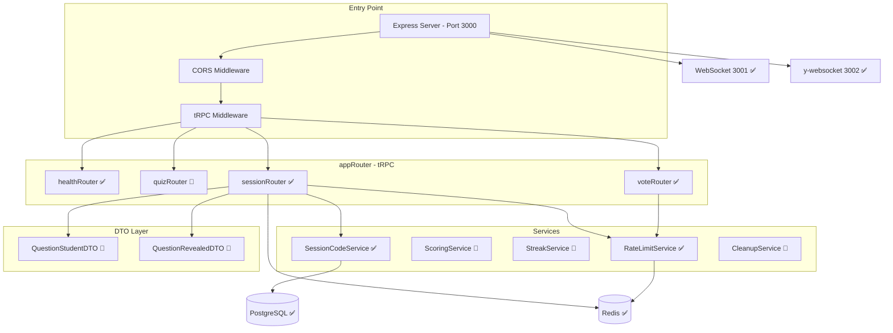

# 🎓 Onboarding: arsnova.click V3

Willkommen im Entwickler-Team von **arsnova.click V3**! Dieses Dokument hilft dir als Informatikstudierende/r, das Projekt zu verstehen, die Entwicklungsumgebung aufzusetzen und produktiv mitzuarbeiten.

---

## 1. Quickstart: Entwicklungsumgebung einrichten

### Voraussetzungen

| Tool | Version | Prüfbefehl |
|------|---------|------------|
| Node.js | ≥ 20 (siehe `.nvmrc`) | `node -v` |
| npm | ≥ 10 | `npm -v` |
| Docker & Docker Compose | aktuell | `docker compose version` |
| Git | aktuell | `git -v` |

### Setup in 5 Schritten

```bash
# 1. Repository klonen
git clone https://github.com/kqc-real/arsnova-click-v3.git
cd arsnova-click-v3

# 2. Umgebungsvariablen anlegen
cp .env.example .env

# 3. Datenbank & Redis starten (Docker)
docker compose up -d
# → Startet PostgreSQL (Port 5432) und Redis (Port 6379)

# 4. Dependencies installieren (npm Workspaces)
npm install
# → Installiert alle Abhängigkeiten für Backend, Frontend und shared-types

# 5. Prisma-Client generieren & Datenbank-Schema synchronisieren
npx prisma generate
npx prisma db push
```

### Entwicklungsserver starten

```bash
# Alles auf einmal (Backend + Frontend parallel):
npm run dev

# Oder einzeln:
npm run dev:backend    # → http://localhost:3000 (tRPC-API)
npm run dev:frontend   # → http://localhost:4200 (Angular)
```

**Funktioniert alles?** Öffne `http://localhost:4200` im Browser. Du solltest die Startseite mit dem **Server-Status-Widget** sehen (Epic 0.4: „X Quiz live · Y Teilnehmer · Z Quizzes durchgeführt" und grün/gelb/roter Status-Indikator). Backend-Health (inkl. Redis) und tRPC laufen auf Port 3000; WebSocket auf 3001, Yjs auf 3002.

---

## 2. Projektstruktur (Monorepo)

Das Projekt nutzt **npm Workspaces**, um Backend, Frontend und geteilte Typen in einem Repository zu verwalten. Änderungen an `@arsnova/shared-types` wirken sich sofort auf Backend und Frontend aus.

```
arsnova-click-v3/
├── apps/
│   ├── backend/              # Node.js + tRPC API-Server
│   │   └── src/
│   │       ├── index.ts      # Express-Server, Startpunkt
│   │       ├── trpc.ts       # tRPC-Initialisierung (Router, Procedures)
│   │       └── routers/      # tRPC-Router (API-Endpunkte)
│   │           ├── index.ts  # appRouter – vereint alle Sub-Router
│   │           ├── health.ts # health.check, health.stats, health.ping
│   │           ├── session.ts# session.create, getInfo, join, getExportData
│   │           └── vote.ts   # vote.submit (mit Rate-Limit)
│   └── frontend/             # Angular 19 Single-Page-App
│       └── src/app/
│           ├── app.component.ts   # Root-Komponente
│           ├── app.routes.ts      # Routing-Konfiguration
│           ├── app.config.ts      # Angular-App-Konfiguration
│           └── trpc.client.ts     # tRPC-Client (Verbindung zum Backend)
├── libs/
│   └── shared-types/         # Geteilte Zod-Schemas und TypeScript-Typen
│       └── src/
│           ├── index.ts      # Re-Exports
│           └── schemas.ts    # ALLE Zod-Schemas, DTOs und Enums
├── prisma/
│   └── schema.prisma         # Datenbankmodell (Single Source of Truth)
├── docs/                     # Dokumentation
│   ├── architecture/         # Architektur-Handbuch + ADRs
│   └── diagrams/             # Mermaid-Architekturdiagramme
├── docker-compose.yml        # PostgreSQL + Redis
├── AGENT.md                  # ⚠️ KI-Coding-Regeln (Pflichtlektüre!)
├── Backlog.md                # Alle User-Storys mit Akzeptanzkriterien
└── package.json              # Root: npm Workspaces + globale Scripts
```

### Wichtige Zusammenhänge

| Paket | npm-Name | Aufgabe |
|-------|----------|---------|
| `apps/backend` | `@arsnova/backend` | API-Server – empfängt Requests, validiert mit Zod, greift auf DB zu |
| `apps/frontend` | `@arsnova/frontend` | Browser-App – Angular-Standalone-Components mit Angular Material 3 und SCSS-Patterns |
| `libs/shared-types` | `@arsnova/shared-types` | Geteilte Verträge – Zod-Schemas, die **beide** Seiten importieren |

> **Typsicherheit:** Wenn du ein Feld im Prisma-Schema änderst, muss das passende Zod-Schema in `libs/shared-types/src/schemas.ts` aktualisiert werden. Andernfalls schlägt der Build fehl.

---

## 3. Architektur-Philosophie

Das System ist nach dem **Local-First**-Prinzip entworfen:

* **Zero-Knowledge:** Der Server speichert Quiz-Inhalte *niemals dauerhaft*. Die „Single Source of Truth" für Quizzes ist die lokale Browser-Datenbank des Dozenten.
* **Datensouveränität:** Das geistige Eigentum (die Fragen) verbleibt beim Dozenten – keine Cloud, kein Account-Zwang.
* **Relay-Modell:** Das Backend fungiert als *flüchtiger Vermittler* für Live-Daten während einer Hörsaal-Sitzung.

---

## 4. Aktueller Stand vs. Ziel-Architektur

> **Epic 0 (Infrastruktur) ist abgeschlossen.** Dieser Abschnitt kennzeichnet, was **bereits implementiert** ist und was als nächstes ansteht (siehe `Backlog.md`).

### Was bereits funktioniert (✅ Implementiert – Stand: Tag `v0-epic0`)

| Komponente | Beschreibung |
|---|---|
| Express + tRPC-Server | Backend auf Port 3000 mit `health.check`, `health.stats`, `health.ping` (Subscription) |
| Angular 19 Frontend | Standalone Components, Signals, Angular Material 3, tokenbasiertes Theming, Startseite mit Server-Status-Widget |
| tRPC-Client | `httpBatchLink` (Queries/Mutations) + `wsLink` (Subscriptions) |
| Redis-Anbindung | `ioredis`-Client, Health-Check, Rate-Limiting (Sliding-Window), Session-Code-Lockout |
| tRPC WebSocket | Separater WebSocket-Server (Port 3001) für Subscriptions |
| Yjs y-websocket Relay | Backend startet y-websocket-Server (Port 3002) für Multi-Device-Sync |
| Server-Status (Epic 0.4) | `health.stats`, Widget auf Startseite (Polling 30s), Schwellwerte healthy/busy/overloaded |
| Session- & Vote-Router | `session` (create, getInfo, join, getExportData) und `vote` (submit) mit Rate-Limiting |
| Prisma-Schema | Vollständiges Datenbankmodell (Quiz, Question, Session, Vote, etc.) |
| Zod-Schemas (`shared-types`) | Alle Input-/Output-Schemas und DTOs definiert |
| Docker Compose | PostgreSQL 16 + Redis 7 (+ optional App-Container) per `docker compose up` |
| CI/CD-Pipeline | GitHub Actions: Prisma validate/generate, TypeScript, ESLint, Tests, Docker-Build (Node 20/22) |

### Was als nächstes ansteht (🔲 Geplant)

| Komponente | Beschreibung | Backlog |
|---|---|---|
| Quiz-Verwaltung | Erstellen, Bearbeiten, Löschen von Quizzes (Local-First mit Yjs/IndexedDB) | Epic 1 (1.1–1.10) |
| Live-Session-Flow | Lobby, Fragen freigeben, Abstimmung, Ergebnis, Leaderboard | Epics 2–4 |
| Service Layer | ScoringService, StreakService, BonusTokenService, CleanupService | Epics 4–5 |
| DTO-Stripping (Runtime) | `isCorrect` serverseitig bei Status `ACTIVE` entfernen (QuestionStudentDTO) | Story 2.4 |

---

## 5. Komponentenbeschreibung (Stand: Epic 0 abgeschlossen)

Das folgende Diagramm zeigt die **Backend-Architektur**. Bereits umgesetzt: health-, session- und vote-Router, Redis-Anbindung, Rate-Limiting, WebSocket und Yjs-Relay.



> ✅ = implementiert (Epic 0) · 🔲 = geplant (Epic 1+)

### A. Frontend (Angular 19)

Das Frontend nutzt modernste Angular-Features:

* **Standalone Components:** Keine `NgModules` – jede Komponente ist eigenständig importierbar.
* **Angular Signals:** Reaktiver UI-Zustand; keine manuellen Subscriptions für State.
* **tRPC-Client:** `httpBatchLink` (Queries/Mutations) und `wsLink` (Subscriptions) – beide aktiv.
* **Server-Status-Widget:** Zeigt auf der Startseite aggregierte Kennzahlen (health.stats, Polling 30s).
* **Yjs & IndexedDB (geplant – Epic 1):** Quiz-Daten Local-First im Browser; Yjs für Multi-Device-Sync.

### B. Backend (Node.js + tRPC)

* **tRPC Router:** health (check, stats, ping), session (create, getInfo, join, getExportData), vote (submit). Typen über `@arsnova/shared-types`.
* **Rate-Limiting (Epic 0.5):** Redis Sliding-Window für Session-Code, Vote-Submit und Session-Erstellung; tRPC-Error `TOO_MANY_REQUESTS` mit Retry-After.
* **Service Layer (teilweise):** SessionCode-Logik im sessionRouter; ScoringService, StreakService, CleanupService folgen in Epics 4–5.
* **DTO Layer (geplant – Story 2.4):** Data-Stripping für `isCorrect` bei Status ACTIVE.
* **Prisma ORM:** Schema in `prisma/schema.prisma`; Migrations/Client per `prisma generate` und `prisma db push`.

### C. Infrastruktur

* **PostgreSQL:** Live-Session-Daten (Sessions, Participants, Votes). Docker Compose.
* **Redis (✅):** Health-Check, Rate-Limiting (ioredis), vorbereitet für Pub/Sub in Epics 2–4.
* **WebSocket (Port 3001):** tRPC-Subscriptions (z. B. health.ping).
* **y-websocket (Port 3002):** Yjs-Relay für Dozenten-Multi-Device-Sync.

---

## 6. Das Zusammenspiel in einer Live-Session (Ziel)

> Dieser Ablauf beschreibt die **fertige Ziel-Architektur**. Nutze ihn als Referenz, um zu verstehen, worauf die Entwicklung hinarbeitet.

1. **Quiz-Upload:** Der Dozent wählt ein Quiz aus seiner lokalen IndexedDB. Das Frontend sendet eine Kopie via `quiz.upload` (Zod-validiert) an das Backend.
2. **Session-Initialisierung:** Das Backend speichert die Quiz-Kopie in PostgreSQL, generiert einen 6-stelligen Code und registriert ihn in Redis.
3. **Lobby-Phase:** Studenten treten mit dem Code bei. Das Backend erstellt einen `Participant`-Eintrag und informiert den Dozenten in Echtzeit via Redis Pub/Sub → tRPC Subscription.
4. **Frage-Aktivierung (Security):**
    * Der Dozent klickt „Nächste Frage".
    * Das Backend setzt den Status auf `ACTIVE`.
    * Das **DTO-Stripping** entfernt `isCorrect` aus den Antwortoptionen.
    * Die gefilterten Daten (`QuestionStudentDTO`) werden via tRPC Subscription an alle Studenten-Smartphones gepusht.
5. **Abstimmung:** Studenten senden ihre Votes. Der ScoringService berechnet Punkte basierend auf Korrektheit, Antwortzeit und Schwierigkeitsgrad.
6. **Auflösung:** Der Dozent beendet die Frage (Status → `RESULTS`). *Erst jetzt* sendet das Backend das vollständige Objekt (`QuestionRevealedDTO` inkl. `isCorrect`) an die Studenten.

---

## 7. Wichtige Regeln für Entwickler

> Diese Regeln sind ausführlich in [`AGENT.md`](../AGENT.md) beschrieben. Hier die Kurzfassung:

| Regel | Beschreibung |
|---|---|
| **Kein `any`** | TypeScript-Typen immer aus `@arsnova/shared-types` importieren |
| **Signals statt RxJS** | Für UI-State ausschließlich Angular Signals verwenden. RxJS nur für WebSocket-Streams |
| **Security First** | Neues Feld an einer Frage? → Prüfen, ob es im `QuestionStudentDTO` entfernt werden muss |
| **Standalone Components** | Keine `NgModules`. Neue `@if`/`@for` Control-Flow-Syntax, kein `*ngIf`/`*ngFor` |
| **Angular Material 3 + SCSS-Patterns** | Styling ueber Material-Komponenten, Design-Tokens und zentrale SCSS-Patterns (ohne Tailwind) |
| **ADRs schreiben** | Architekturentscheidungen als ADR in `docs/architecture/decisions/` dokumentieren |

---

## 8. Pflichtlektüre

| Dokument | Inhalt |
|---|---|
| [`AGENT.md`](../AGENT.md) | KI-Coding-Regeln und Architektur-Leitplanken |
| [`Backlog.md`](../Backlog.md) | Alle User-Storys mit Priorität und Akzeptanzkriterien |
| [`docs/architecture/handbook.md`](architecture/handbook.md) | Ausführliches Architektur-Handbuch |
| [`docs/architecture/decisions/`](architecture/decisions/) | Architecture Decision Records (ADRs) |
| [`docs/diagrams/diagrams.md`](diagrams/diagrams.md) | Mermaid-Diagramme (Backend, Frontend, DB, Sequenz) |
| [`prisma/schema.prisma`](../prisma/schema.prisma) | Datenbankmodell – Single Source of Truth |
| [`libs/shared-types/src/schemas.ts`](../libs/shared-types/src/schemas.ts) | Alle Zod-Schemas und DTOs |

### Zurücksetzen auf einen bekannten Stand

Falls die Umgebung kaputt geht oder du einen sauberen Ausgangspunkt brauchst:

| Git-Tag | Beschreibung |
|---------|--------------|
| **`v0-epic0`** | Stand nach Epic 0 (Redis, WebSocket, Yjs, Server-Status, Rate-Limiting, CI/CD) – **empfohlen** |
| **`v0-baseline`** | Nur Projekt-Skeleton (vor Epic 0) |

```bash
git reset --hard v0-epic0
npm install
```

---

## 9. Glossar

| Begriff | Erklärung |
|---|---|
| **Monorepo** | Ein einzelnes Git-Repository, das mehrere Pakete enthält (hier: Backend, Frontend, shared-types). Verwaltet über npm Workspaces. |
| **tRPC** | TypeScript Remote Procedure Call – Framework für typsichere API-Kommunikation ohne REST-Boilerplate. Frontend und Backend teilen sich die Typen direkt. |
| **Zod** | TypeScript-Validierungsbibliothek. Definiert Schemas, die sowohl zur Laufzeit (Eingabevalidierung) als auch zur Compile-Zeit (Typen) genutzt werden. |
| **Prisma** | ORM (Object-Relational Mapping) für Node.js. Übersetzt TypeScript-Objekte in SQL-Queries. Das Schema in `schema.prisma` definiert die Datenbankstruktur. |
| **DTO** | Data Transfer Object – ein gefiltertes Datenobjekt, das nur die Felder enthält, die der Empfänger sehen darf. Zentral für die Sicherheit (kein `isCorrect` für Studenten). |
| **CRDT** | Conflict-free Replicated Data Type – Datenstruktur, die parallele Änderungen auf mehreren Geräten automatisch und ohne Konflikte zusammenführt. Verwendet über die Bibliothek Yjs. |
| **Yjs** | JavaScript-Bibliothek für CRDTs. Speichert Daten in IndexedDB (Browser-Datenbank) und synchronisiert Änderungen als kleine „Deltas" über WebSockets. |
| **Pub/Sub** | Publish/Subscribe – Messaging-Muster, bei dem ein Sender (Publisher) Nachrichten veröffentlicht und alle registrierten Empfänger (Subscribers) diese erhalten. Umgesetzt über Redis. |
| **ADR** | Architecture Decision Record – kurzes Dokument, das eine technische Entscheidung, ihre Begründung und Alternativen festhält. Liegt unter `docs/architecture/decisions/`. |
| **Subscription** | tRPC-Mechanismus für Echtzeit-Kommunikation über WebSockets. Der Client registriert sich für Events, die der Server aktiv pusht (z. B. „neuer Teilnehmer beigetreten"). |
| **IndexedDB** | Browsereigene NoSQL-Datenbank für große Datenmengen. Wird hier von Yjs genutzt, um Quizzes lokal zu persistieren – auch nach Browser-Neustart. |
| **Data-Stripping** | Sicherheitsmechanismus: Das Backend entfernt sensible Felder (z. B. `isCorrect`) aus Objekten, *bevor* sie an Studenten gesendet werden – verhindert Schummeln via DevTools. |

---

Viel Erfolg bei der Entwicklung von arsnova.click V3! 🚀 Bei Fragen: Schau zuerst in die [Pflichtlektüre](#8-pflichtlektüre), dann frag im Team.
